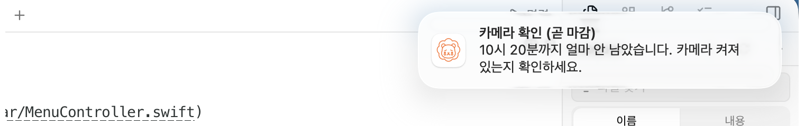
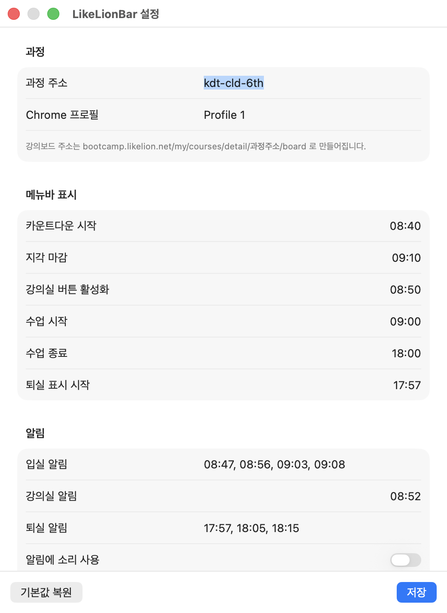

# LikeLionBar

부트캠프 출결을 까먹지 않게 해주는 macOS 메뉴바 앱.

> 개인이 만든 **비공식** 도구입니다. 멋쟁이사자처럼과 무관합니다.



---

## 왜 만들었나

부트캠프 출결은 하루에 손이 여러 번 갑니다.

| 시점 | 할 일 | 놓치면 |
|---|---|---|
| 아침 | QR 입실 (고용24 인증) | **지각. 3번이면 불참** |
| 아침 | 강의실 입장 (휴대폰 인증) | 출석 미인정 |
| 매시간 | 정각~20분 사이 카메라로 사진 | 그 시간 미인정 |
| 저녁 | QR 퇴실 | **그날 출석이 통째로 날아감** |

자리에 앉아 있는데 절차를 까먹어서 손해 보는 게 문제입니다.

알림은 한 번 넘기면 끝입니다. 하지만 **메뉴바에서 지각까지 남은 시간이 초 단위로 줄어드는 건 무시하기 어렵습니다.** 이 앱은 거기에 기댑니다.

---

## 사자 표정으로 상태 읽기

숫자를 읽지 않아도 곁눈질만으로 상황이 전달되게 만들었습니다. 시간이 촉박해질수록 사자가 **무표정 → 화남 → 울음**으로 악화되고, 할 일을 마치면 웃습니다.

| | 표정 | 언제 | 메뉴바 |
|:---:|---|---|---|
|  | 무표정 | 조를 것이 없을 때, 주말, 쉬는 날 | 아이콘만 |
|  | 무표정 · 빨강 | 입실 마감까지 아직 여유가 있을 때 | `22:59` |
|  | 화남 · 빨강 | 마감 5분 미만 · 사진 마감 임박 | `04:59` 깜빡임 |
|  | 울음 · 빨강 | 지각 확정 | `지각` |
|  | 화남 · 주황 | 강의실 입장·퇴실을 아직 안 했을 때 | `강의실` `퇴실` |
|  | 웃음 · 초록 | 오늘 할 일을 마침 | 아이콘만 |

---

## 하루 흐름

```
08:40  카운트다운 시작        🦁 22:59
08:47  입실 알림 ①
08:52  강의실 입장 알림
08:56  입실 알림 ②
09:03  입실 알림 ③
09:05  마감 5분 전            🦁 04:59  깜빡임 시작
09:08  입실 알림 ④ "지금 안 하면 지각입니다"
09:10  ── 지각 마감 ──        🦁 지각

10:02  10시 사진 알림 ①
10:12  10시 사진 알림 ②      🦁 사진 07:59  카운트다운 시작
10:18  마감 2분 전                          깜빡임
10:20  ── 사진 마감 ──
       (11·13·14·15·16·17시 반복, 점심 12시대는 건너뜀)

17:57  퇴실 알림 ①           🦁 퇴실
18:05  퇴실 알림 ②
18:15  퇴실 알림 ③
```

처리한 뒤 메뉴에서 **완료로 표시**하면 남은 알림이 즉시 멈춥니다. 알림 배너의 `완료로 표시` 버튼으로도 됩니다.

자정이 지나면 그날 기록이 자동으로 초기화됩니다.

---

## 설치

**macOS 14 (Sonoma) 이상**이 필요합니다. Apple Silicon·Intel 모두 지원합니다.
Windows·Linux에서는 실행되지 않습니다 — 메뉴바와 알림이 macOS 전용 기능입니다.

1. [Releases](../../releases)에서 `LikeLionBar.zip`을 받아 압축을 풉니다
2. **`/응용 프로그램`으로 옮깁니다** — 로그인 시 자동 시작이 이 위치에서만 안정적으로 등록됩니다
3. 실행하면 메뉴바에 사자가 생깁니다. 알림 권한을 허용하세요
4. 메뉴 → `설정…`에서 **과정 주소**와 **Chrome 프로필**을 본인 것으로 바꿉니다
5. 맨 아래 **`로그인 시 자동 시작`을 켜고 `저장`** — 이걸 안 켜면 매일 직접 실행해야 합니다

Apple 공증(notarization)을 받았으므로 "확인되지 않은 개발자" 경고 없이 열립니다.

---

## 설정



시간표는 기수·과정마다 다르므로 **모든 시각을 바꿀 수 있습니다.** 기본값은 참고용입니다.

### 과정 주소 찾기

강의보드 URL이 `bootcamp.likelion.net/my/courses/detail/`**`kdt-cld-6th`**`/board` 라면
굵은 부분이 과정 주소입니다.

### Chrome 프로필 찾기

부트캠프에 로그인된 Chrome 창에서 `chrome://version`을 열고 `프로필 경로`의 마지막 폴더명
(`Default`, `Profile 1` 등)을 넣습니다. 비워두면 기본 프로필을 씁니다.

> Chrome이 이미 실행 중이면 프로필 지정이 무시될 수 있습니다. 그럴 땐 해당 프로필 창을
> 띄워둔 상태로 쓰세요.

### 주요 항목

| 항목 | 뜻 |
|---|---|
| 카운트다운 시작 | 이 시각부터 메뉴바에 남은 시간이 뜹니다 |
| 지각 마감 | 카운트다운의 목표점 |
| 강의실 버튼 활성화 | `강의실 입장` 버튼이 실제로 눌리기 시작하는 시각 |
| 입실·퇴실 알림 | 쉼표로 여러 개. 마지막 입실 알림은 최종 경고로 다뤄집니다 |
| 알림에 소리 사용 | **기본 꺼짐.** 끄면 배너만 뜹니다 |
| 사진 마감·알림 | 정각 기준 분. 마감을 `0`으로 두면 사진 기능을 끕니다 |

---

## 내 알림

병원·외출 같은 개인 일정도 넣을 수 있습니다. 설정 맨 아래 **`내 알림`** 섹션에서 추가합니다.

```
13:40   병원              ☐ 매 평일   ⊖
15:10   나가야 함          ☑ 매 평일   ⊖
        [ 알림 추가 ]
```

- **`매 평일`을 끄면** 오늘 하루만 울리고 다음 날 목록에서 자동으로 사라집니다
- **켜면** 평일마다 반복됩니다
- 메뉴를 열면 오늘 울릴 목록이 보이고, 이미 지난 것은 흐리게 표시됩니다

일회성 알림은 **쉬는 날로 표시해도 울립니다.** 병원 예약을 쉬는 날이라고 거를 순 없으니까요.
반대로 매 평일 반복은 쉬는 날에 쉽니다.

---

## 하지 않는 일

**고용24 인증과 휴대폰 인증을 대신하거나 우회하지 않습니다.**

그 절차는 실제로 그 자리에 있는지 확인하려고 존재하고, 국비 지원 훈련과정의 출결이라
우회는 부정훈련 문제가 됩니다. 이 앱은 "언제 뭘 해야 하는지"를 놓치지 않게 해줄 뿐이고,
출석은 본인이 합니다.

---

## 문제가 생기면

메뉴 → **`기록 폴더 열기`** 안의 파일을 보면 상황을 알 수 있습니다.

| 파일 | 내용 |
|---|---|
| `debug.log` | 실행·알림·설정 변경 기록 (512KB 넘으면 회전) |
| `state.json` | 오늘 진행 상황 |
| `log.jsonl` | 전체 이력 |

**알림이 안 뜬다면** `시스템 설정 → 알림 → LikeLionBar`에서 허용됐는지 확인하세요.
배너를 자주 놓친다면 알림 스타일을 `배너` 대신 **`알림`**으로 바꾸면 직접 닫을 때까지 남습니다.

**로그인 시 자동 시작이 실패하면** 앱이 `/응용 프로그램`에 있는지 확인하세요.
임시 폴더나 다운로드 폴더에서는 등록이 거부됩니다.

---

## 개발

Xcode 없이 **Command Line Tools만으로** 빌드·서명·공증됩니다.

```bash
swift run CoreChecks          # 검사 (XCTest 없이 도는 자체 하네스)
./scripts/bundle.sh           # .app 조립 + ad-hoc 서명
./scripts/bundle.sh release   # 유니버설 바이너리 (arm64 + x86_64)
```

### 미리보기

다음날 아침을 기다리지 않고 임의 시각의 상태를 볼 수 있습니다.
실제 출결 기록은 건드리지 않고 임시 폴더에 따로 씁니다.

```bash
./scripts/preview.sh 08:47:00                     # 입실 카운트다운
./scripts/preview.sh 09:04:30                     # 30초 뒤 깜빡임 전환
./scripts/preview.sh 09:11:00                     # 지각
./scripts/preview.sh 09:30:00 checkIn             # 강의실 조르기
./scripts/preview.sh 17:58:00 checkIn,classroom   # 퇴실
./scripts/preview.sh 08:46:30 "" 30               # 30배속 (아침 21분 → 45초)
```

| 환경 변수 | 용도 |
|---|---|
| `LIKELIONBAR_FAKE_TIME` | 시작 시각 (`2026-07-28T08:47:00`) |
| `LIKELIONBAR_FAKE_SPEED` | 배속. 알림 시퀀스를 압축해서 볼 때 |
| `LIKELIONBAR_FAKE_DONE` | 완료 단계 (`checkIn,classroom`) |
| `LIKELIONBAR_FAKE_PHOTOS` | 찍은 시간대 (`9,10,11,13`) |
| `LIKELIONBAR_TRACE` | 매 틱의 판단 근거를 로그에 남김 |
| `LIKELIONBAR_OPEN_SETTINGS` | 실행하자마자 설정 창 열기 |

### 배포

```bash
./scripts/make-icon.sh lion.png   # 1024x1024 PNG → AppIcon.icns
./scripts/bundle.sh release
./scripts/sign.sh                 # Developer ID 서명
./scripts/notarize.sh             # 공증 + 티켓 첨부
```

### 구조

```
Sources/
├── LikeLionBarCore/    순수 로직. AppKit에 의존하지 않아 시각을 주입해 검증한다
│   ├── ScheduleEngine    시각·상태 → 메뉴바 표시
│   ├── ReminderEngine    두 틱 사이에 지나간 알림 찾기
│   ├── StateStore        영속화·날짜 롤오버·이력
│   └── CustomReminder    사용자 등록 알림
├── LikeLionBar/        AppKit UI
└── CoreChecks/         검사 하네스
```

---

## 앞으로 할 것

- [ ] **주간·월간 기록 보기** — `log.jsonl`에 쌓기만 하고 보여주지 않는다. 지각 횟수와 출석률을 보여주면 수료 조건(80%) 관리에 쓸 수 있다
- [ ] **새 버전 확인** — 배포한 뒤 버전이 올라가도 알릴 방법이 없다. 릴리스를 확인해 메뉴에 표시
- [ ] **설정 창 탭 분리** — 섹션이 여섯 개라 화면 높이를 넘긴다
- [ ] **`강의실 입장` 버튼 활성화 시각 확인** — 08:50은 관찰값이 아니라 추정이다
- [ ] **데이터 파일 권한 조이기** — 현재 644라 같은 기기의 다른 사용자가 읽을 수 있다. 개인 일정 제목이 들어가므로 600이 맞다
- [ ] **공휴일 응답 크기 제한** — 외부 응답을 크기 제한 없이 받고 있다

## 라이선스

[MIT](LICENSE) — 자유롭게 가져다 쓰고 고치세요.

다른 기수·과정에 맞게 포크하실 거라면 `설정`에서 과정 주소와 시각만 바꾸면 되고,
코드를 고칠 필요는 없습니다.
